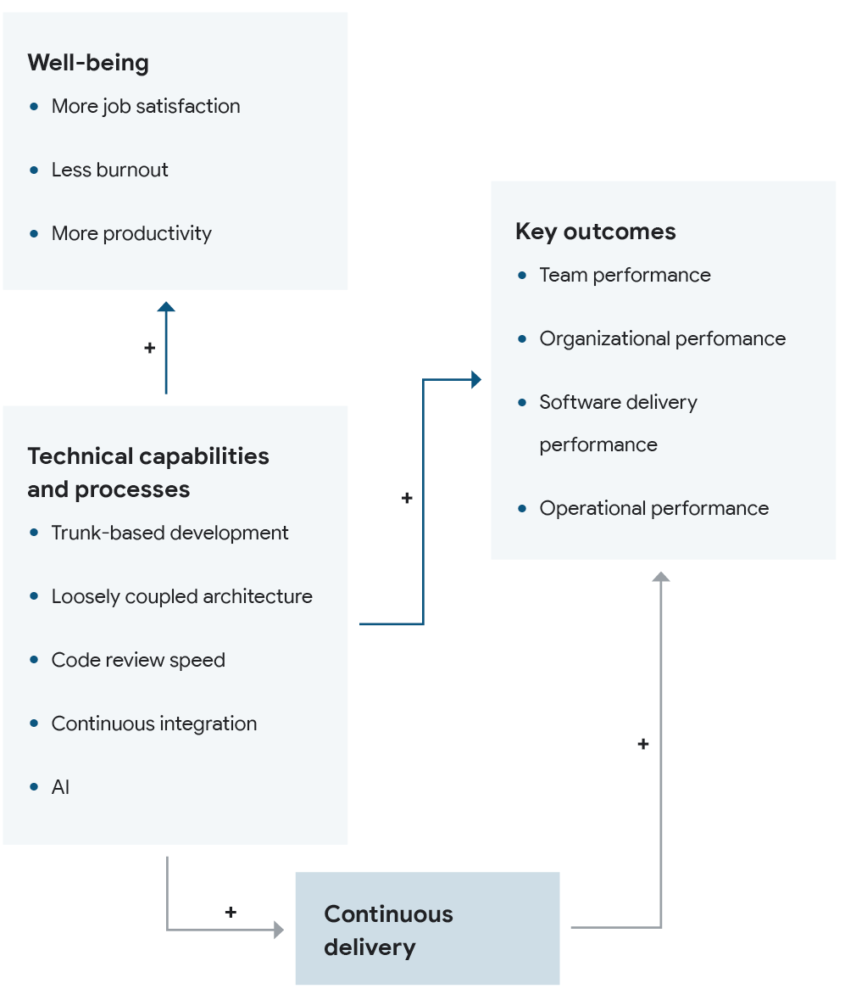
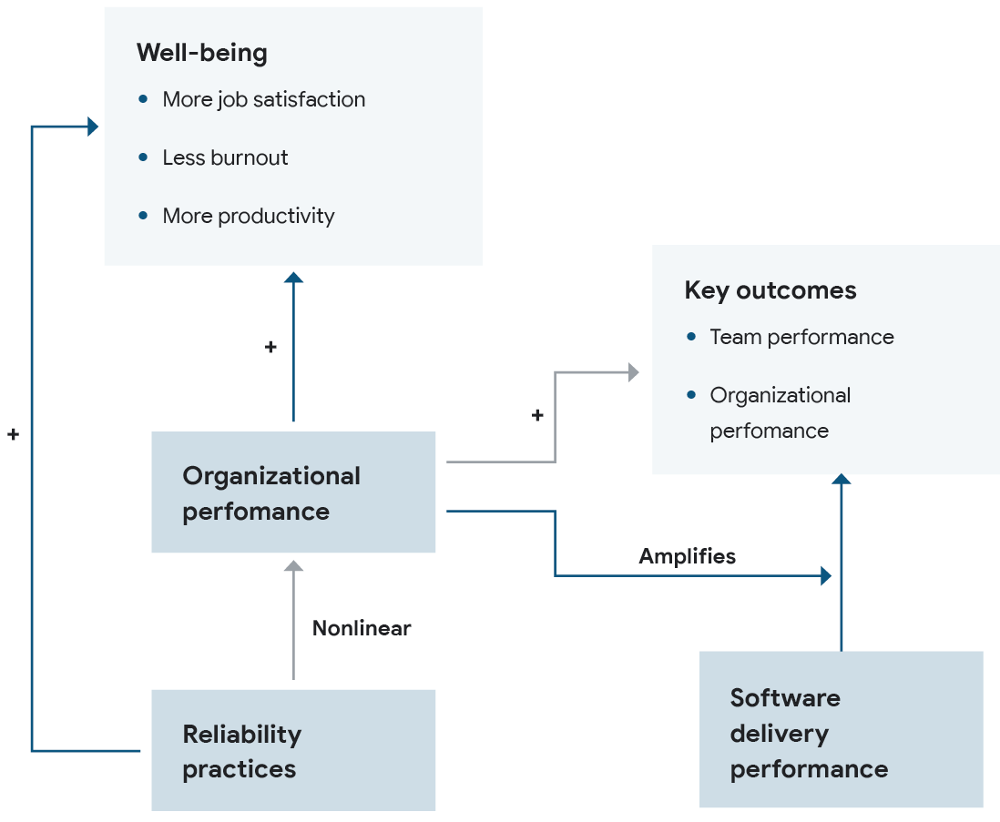
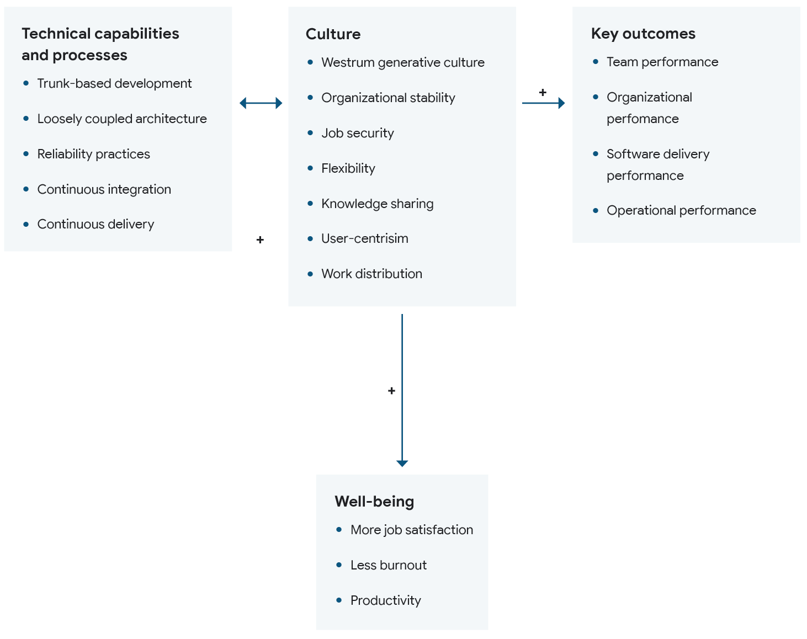
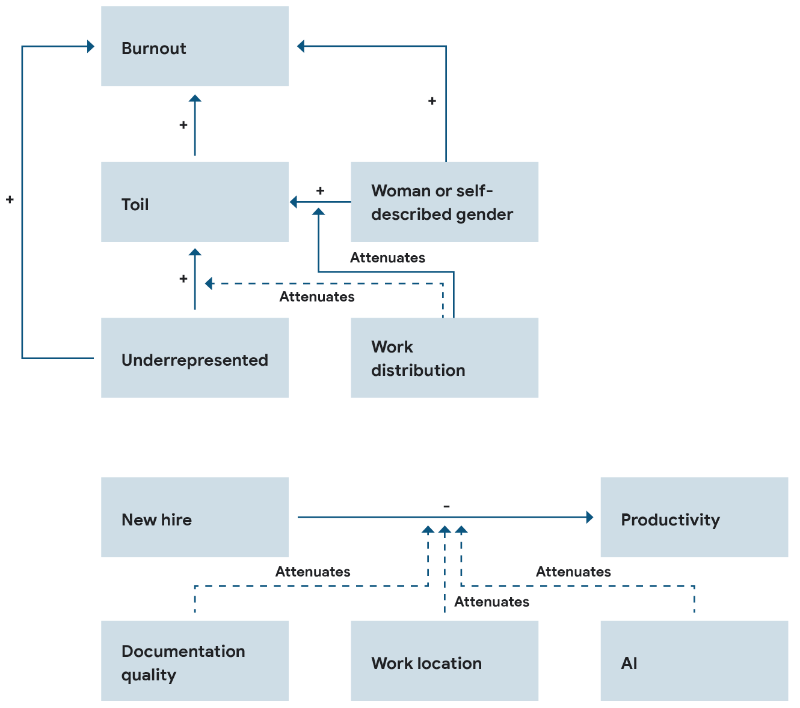

Traditionally, we created one giant model. This year we decided to break it down into multiple models for the following reasons:

* Huge models can become unwieldy, fast. Every added variable changes the way the model functions. This can lead to inaccurate estimates and makes it difficult to locate the reason for a change.
* We created our hypotheses section-by-section this year. Thus, it makes sense to just create a model for each section. 
* It isn’t obvious what the benefit of a giant model is in estimating the effect of X on Y. To understand the impact of X on Y, we used directed acyclic graphs to help understand what covariates we should and shouldn’t include in the model.
* The number of hypotheses we addressed this year would make it very difficult for the reader to make sense of the giant model. Imagine combining all the visualizations below into one visualization. 

